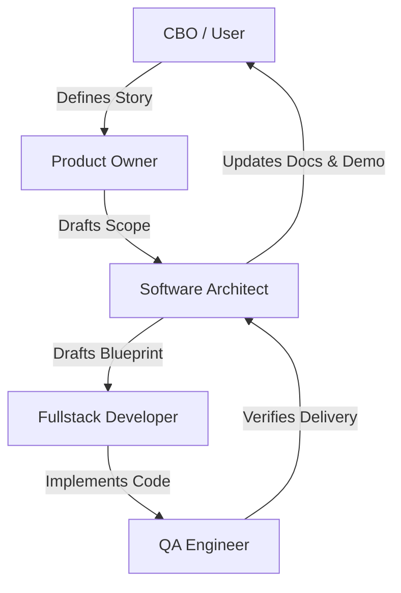

# Architecture Overview

Briefly describe what the system is, what problem it solves, who/what uses it, and the major architectural style or pattern if evident.

## 1. Project Structure
This section provides a high-level overview of the project's directory and file structure, categorised by architectural layer or major functional area.

```
[Project Root]/
├── .agents/              # Custom agent skills and tool specifications
│   └── skills/           # Crew skills (e.g. product-owner, software-architect, fullstack-developer)
├── .bmc-stuff/           # Baremetal-Crew infrastructure, binaries, and work files
│   ├── bin/              # Helper binaries and executables (e.g. bmc-log, bmc-index-skills)
│   ├── knowledge/        # System knowledge base (manifesto, guardrails, tech stack)
│   │   └── templates/    # Templates for scopes, blueprints, demos, and architecture
│   └── work/             # Active slice artifacts (SXX-SCOPE.md, SXX-BLUEPRINT.md, SXX-DEMO.md)
├── install.sh            # Baremetal-Crew installation script
├── README.md             # Project overview and quick start guide
└── ARCHITECTURE.md       # This document
```

## 2. High-Level System Diagram
Provide a simple block diagram or a clear text-based description of the major components and their interactions using Mermaid. Emphasize user entry points, runtime boundaries, internal modules, and communication flows.



## 3. Core Components
Describe each major component of the system. For each, include its primary responsibility and key technologies/runtimes used.

### 3.1. Frontend
*   **Name:** E.g., Web App Portal
*   **Description:** UI components, views, state management, and interface rendering details.
*   **Technologies:** E.g., HTML, CSS, JavaScript / framework details.
*   **Deployment:** Host serving details.

### 3.2. Backend Services
*   **Name:** E.g., API Gateway Service
*   **Description:** Routing, service layers, business logic, endpoints, and authentication middleware.
*   **Technologies:** E.g., Node.js / Express, Python / FastAPI.
*   **Deployment:** Server runtime or container deployment details.

## 4. Data Stores
List and describe the databases and other persistent storage solutions used.

### 4.1. Primary Database
*   **Name:** Primary DB
*   **Type:** E.g., SQLite, PostgreSQL
*   **Purpose:** Persistent storage of transactional data.
*   **Key Schemas/Tables:** Important tables and their schemas.

## 5. External Integrations / APIs
List any third-party services or external APIs the system interacts with.

*   **Service Name:** E.g., Stripe, SendGrid
*   **Purpose:** Description of the purpose of the integration.
*   **Integration Method:** SDK or API details.

## 6. Deployment & Infrastructure
*   **Cloud Provider / Environment:** E.g., AWS, GCP, Local host Docker
*   **Key Services Used:** Orchestration, storage, servers.
*   **CI/CD Pipeline:** Deployment and build pipelines.
*   **Monitoring & Logging:** Observability tools and error tracking.

## 7. Security Considerations
*   **Authentication:** E.g., OAuth2, JWT, Session tokens
*   **Authorization:** E.g., Role-Based Access Control (RBAC)
*   **Data Encryption:** Transit and rest protocols.
*   **Key Security Tools:** Firewalls, secrets management.

## 8. Development & Testing Environment
*   **Local Setup Instructions:** Quick steps to spin up the local development env.
*   **Testing Frameworks:** E.g., Jest, Pytest, Playwright
*   **Code Quality Tools:** E.g., ESLint, Black, Prettier

## 9. Future Considerations / Roadmap
*   Planned major refactorings, architectural debt, or migration routes.

## 10. Project Identification
*   **Project Name:** [Insert Project Name]
*   **Repository URL:** [Insert Repository URL]
*   **Primary Contact/Team:** [Insert Lead Developer/Team Name]
*   **Date of Last Update:** [YYYY-MM-DD]

## 11. Glossary / Acronyms
*   **CBO:** Chief Business Officer
*   **PO:** Product Owner
*   **SA:** Software Architect
*   **QA:** QA Engineer
